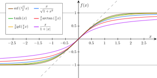

Artifical Neural Network
=================

Artificial neural networks is a type of statistical learning algorithm that is inspired by biological neural networks (the central nervous systems of animals, in particular the brain) and are used to estimate or approximate functions that can depend on a large number of inputs and are generally unknown. Artificial neural networks are generally presented as systems of interconnected "neurons" which can compute values from inputs, and are capable of machine learning thanks to their adaptive nature.

General Neural Network

Each circle represents a Neuron. What a neuron does is sums the inputs of the outputs of the neurons that feed into it multiplied by the weight of the connection, applies a logistical function  to the sum then sends that value to the nodes it is connected to to the right.

General Neuron

A logistic function, also called a transfer function, maps the output of a neuron to a set of values. Generally to the range of the values is [-1, 1] or [0,1]. Here is a graph showing several different logistical functions

Various different logistical functions

This program has the functions and derivatives of the logistical functions step, sigmoid, as well as tanh. Feel free to add other logistical functions to your own discretion. 

The last part of a neural network are the weights that accompany each connection. These weights are the dynamic part of the network. They are adjusted in a process called back propagation in an attempt to generate the proper output given an input for every case of inputs and outputs.

How do you use this?

The file tester.cpp in source is a generic tester for a given set of data. It takes the data that passes as the constructor
for trainData, and trains the network on that data and the architecture (and weights) specified in the file. Once the training is completed, either because the network converged or the max training iterations has occurred, then the network will write what it's trained outputs are to "finalOutput.txt", as well as save the network (the weights), to the file "weights1). 
